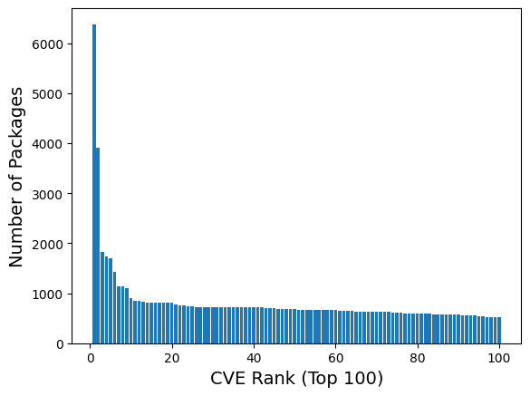
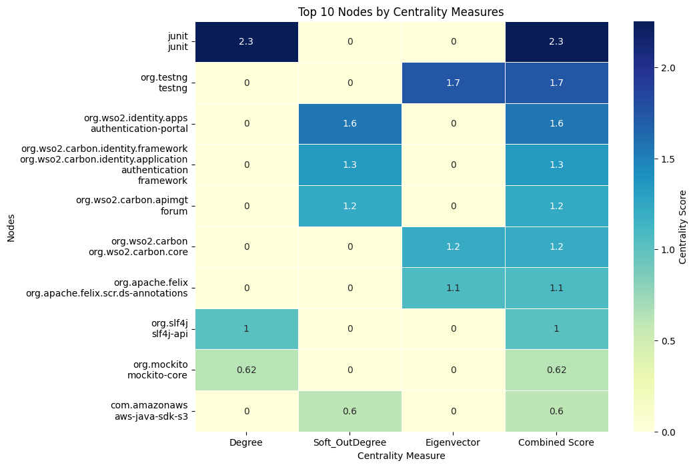
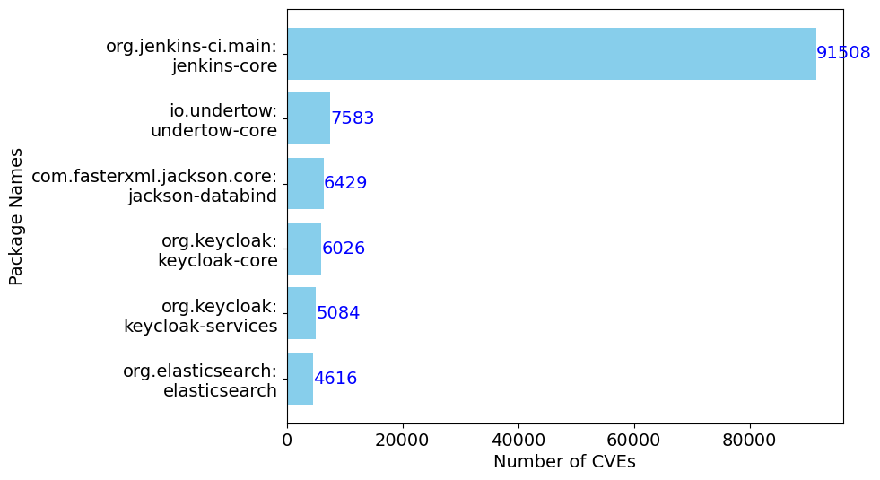

# DPAnalyzer
dependency propagation analyser on graphs

## Structure

- cause: causality analysis part, implementation of custom DAS, the code to generate two files with CVE related features (one-hop neighbor, two-hop neighbor)

- cent: three centrality measurement methods: degree (three directions), betweenness, and eigenvector

- data: extracted other format data sets

- exp: the exploration code on different files, code to call diverse centrality measurement

- process: the code to call neo4j and export other formats of graphs, like graphml and csv


## Instructions
- How to install Goblin Weaver
```
java -Dneo4jUri="bolt://localhost:7687/" -Dneo4jUser="neo4j" -Dneo4jPassword="password" -jar goblinWeaver-2.1.0.jar
```

## Data Export
- configuration of neo4j.conf: add the following lines to conf file to enable apoc output
```
dbms.security.procedures.unrestricted=apoc.*
dbms.security.procedures.allowlist=apoc.*
apoc.export.file.enabled=true
```

- run script:
```
# export dump into graphml and csv formats
python3 data_export.py
```

## Running Instructions 
(tested on macOS and Ubuntu 20.04.5 LTS for small-scale data)

```
# configure virtualenv environment
curl https://pyenv.run | bash
export PYENV_ROOT="$HOME/.pyenv"
[[ -d $PYENV_ROOT/bin ]] && export PATH="$PYENV_ROOT/bin:$PATH"
eval "$(pyenv init -)"
eval "$(pyenv virtualenv-init -)"

# specify python version
pyenv install 3.10
pyenv global 3.10

# create local environment
pyenv virtualenv 3.10 DPAnalyzer
eval "$(pyenv init -)"
eval "$(pyenv virtualenv-init -)"
pyenv activate DPAnalyzer

# download dependencies
pip3 install -r requirmentst.txt

# centrality measurement --- comment different parts to run different measurements
python3 cent_cal.py

# causality analysis
python3 cau_dis.py

```


## Statistical Analysis (extra material)

- Distributed of Number of Packages per CVE (Top 100):
    
    


- Releases by number of CVEs (Top 6):

    


- Top 10 Packages with Vulnerable Releases: 
    
    


- Top 10 Packages with Highest Degree Centrality:   

    


- Top 10 Vulnerable Releases with Highest Out-degree:

    


- Top 10 Nodes Heatmap:

    

- Package by number of CVEs:

    
